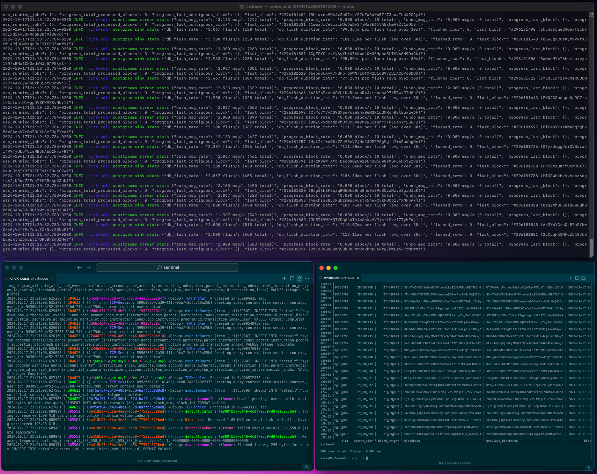

# solana-indexer-rs

Index the Solana chain using Substreams and Clickhouse in Rust

## Supported Programs

- Raydium AMM
- SPL Token Program
- Pumpfun
- System Programxz
- MPL Token Metadata (limited support)

You can checkout [`schema.sql`](schema.sql) to see the data that is indexed.

If you have any suggestions on other programs that should be supported, feel free to open an issue!

## Usage

1. Download and install `ClickHouse` and `substream-sink-sql`
   [Download `substream-sink-sql` v4.2.0](https://github.com/streamingfast/substreams-sink-sql/releases/tag/v4.2.0).

```bash
curl https://clickhouse.com/ | sh
```

```bash
./clickhouse server
```

```bash
./clickhouse client
```

2. Get `StreamingFast` API Key
   https://www.streamingfast.io/ : https://thegraph.market/

3. Setup `DSN`, `SUBSTREAMS_API_TOKEN` and `STREAMINGFAST_KEY` environment variables.

```bash
export DSN="clickhouse://default:@localhost:9000/default"
export STREAMINGFAST_KEY=
export SUBSTREAMS_API_TOKEN=
```

4. Run `make setup_db` to setup the necessary tables.

5. Run `. ./token.sh` to setup the `SUBSTREAMS_API_TOKEN` environment variable.

6. Run the sink with `make sink START=<slot>`.



Please note that setting up `DSN` involves creating a clickhouse database and making it available by some combination of connection and credentials, both of which are described by the `DSN` variable.

Another important point is that if you start the indexing (step 5 of usage) on not so recent blocks, this will be done by batchs of a thousand, so you will have to wait a little while until you start seeing changes being pushed to the database. Once the indexer reaches the head though, new blocks are inserted as soon as they're ready (15-20 seconds of delay for me).
